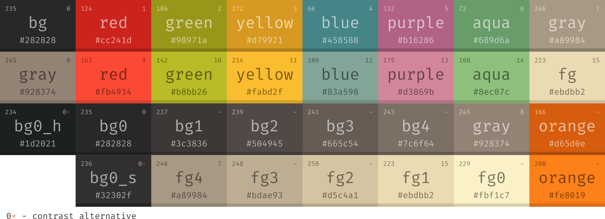
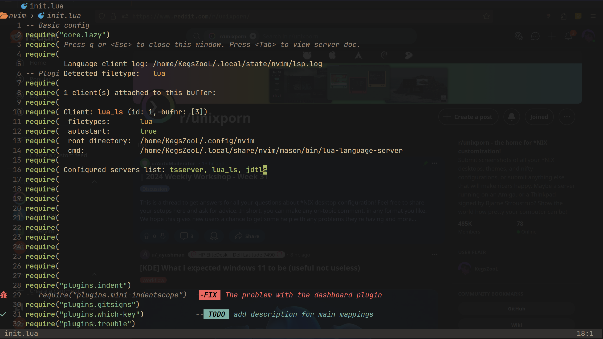

# My nvim config

- This configuration was based on the gruvbox style



<details>
    <summary><strong>Preview config</strong></summary>
    
+   <details>
        <summary style="font-size: 1.0em; font-weight: bold;">Start page</summary>
        
    </details>

+   <details>
        <summary style="font-size: 1.0em; font-weight: bold;">Main file</summary>
        
    </details>

+    <details>
        <summary style="font-size: 1.0em; font-weight: bold;">Navigation</summary>
        
        
        
        
        
     </details>

+   <details>
        <summary style="font-size: 1.0em; font-weight: bold;">Language Server Protocol support</summary>
        
        
        
        
     </details>

+    <details>
        <summary style="font-size: 1.0em; font-weight: bold;">Debug Adapter Protocol client support</summary>
        
     </details>

+    <details>
        <summary style="font-size: 1.0em; font-weight: bold;">Preview and insert emoji/nerd font glyphs</summary>
        
        
     </details>

+    <details>
        <summary style="font-size: 1.0em; font-weight: bold;">Preview markdown file</summary>
        
     </details>

</details>

#### 📁 Nvim File tree

```
.
├── init.lua
└── lua
    ├── core
    │   ├── configs.lua
    │   ├── lazy.lua
    │   └── mappings.lua
    ├── plugins
    │   ├── autopairs.lua
    │   ├── bufferline.lua
    │   ├── cmp.lua
    │   ├── colorizer.lua
    │   ├── colorscheme.lua
    │   ├── colortils.lua
    │   ├── comment.lua
    │   ├── dap-ui.lua
    │   ├── dap-virtual-text.lua
    │   ├── dap.lua
    │   ├── dashboard.lua
    │   ├── emoji.lua
    │   ├── gitsigns.lua
    │   ├── indent.lua
    │   ├── java.lua
    │   ├── jdtls.lua
    │   ├── lspconfig.lua
    │   ├── lspsaga.lua
    │   ├── lualine.lua
    │   ├── mason-lspconfig.lua
    │   ├── mason-nvim-dap.lua
    │   ├── mason.lua
    │   ├── mini-indentscope.lua
    │   ├── move.lua
    │   ├── neotree.lua
    │   ├── nerdy.lua
    │   ├── noice.lua
    │   ├── nvim-notify.lua
    │   ├── surround.lua
    │   ├── telescope.lua
    │   ├── toggleterm.lua
    │   ├── treesitter.lua
    │   ├── trouble.lua
    │   └── whichkey.lua
    └── ascii-art.lua
```
 
### 📜 TODO

- [x] Preview markdown
- [x] Preview html/css (browser-sync)
- [x] Preview and insert emoji
- [x] Preview and insert nerd font glyphs
- [x] Full DAP setup
- [x] Language support: python, css, html
- [ ] Description for all command/functions
