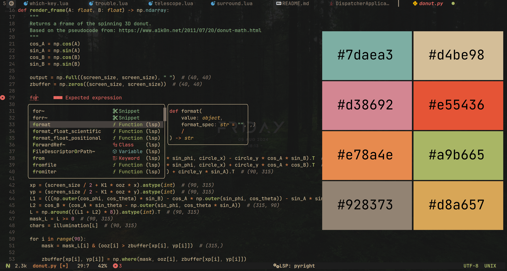
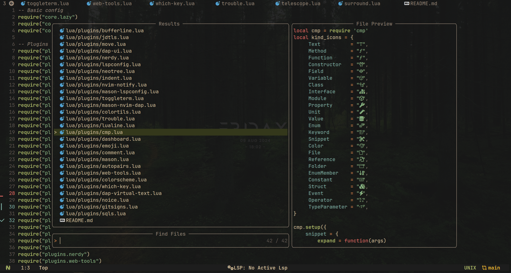
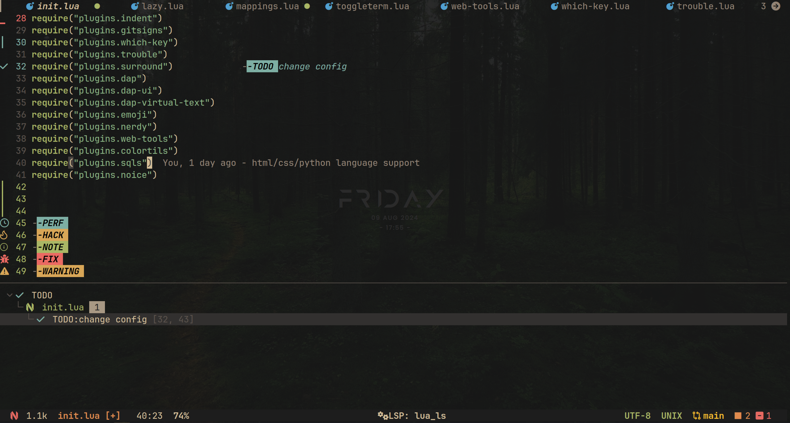
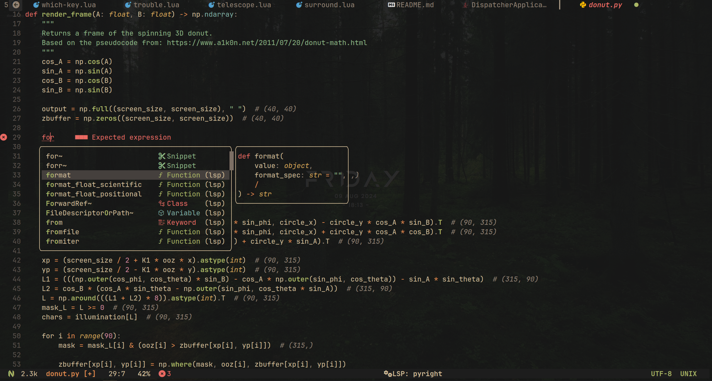
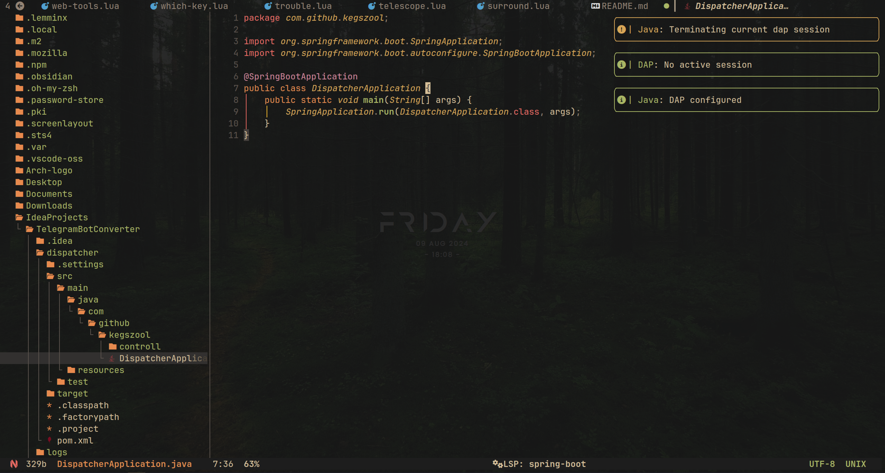
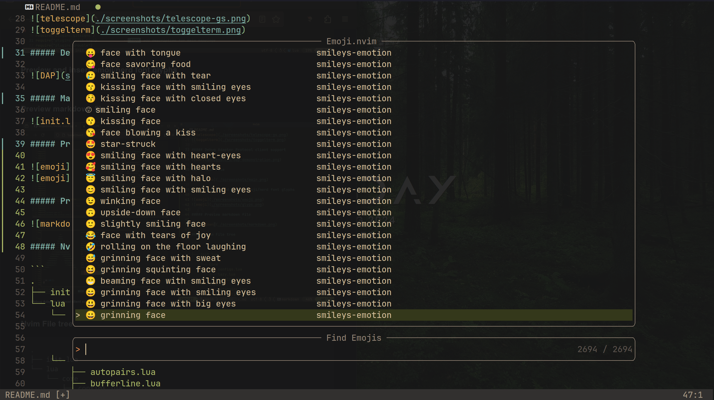
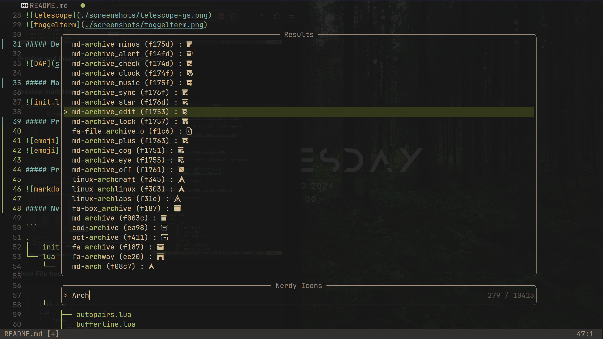
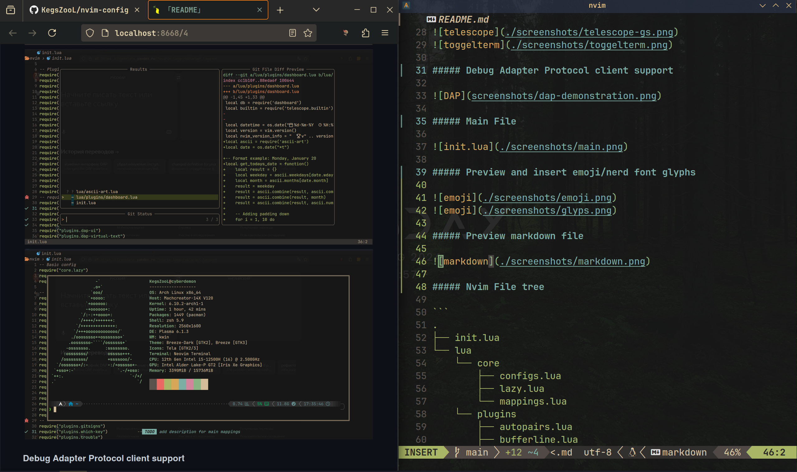
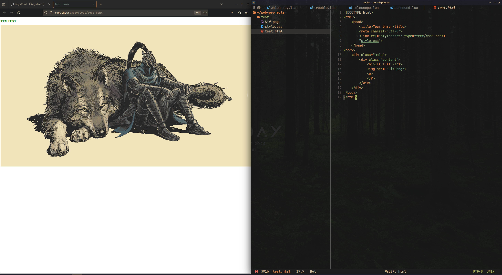
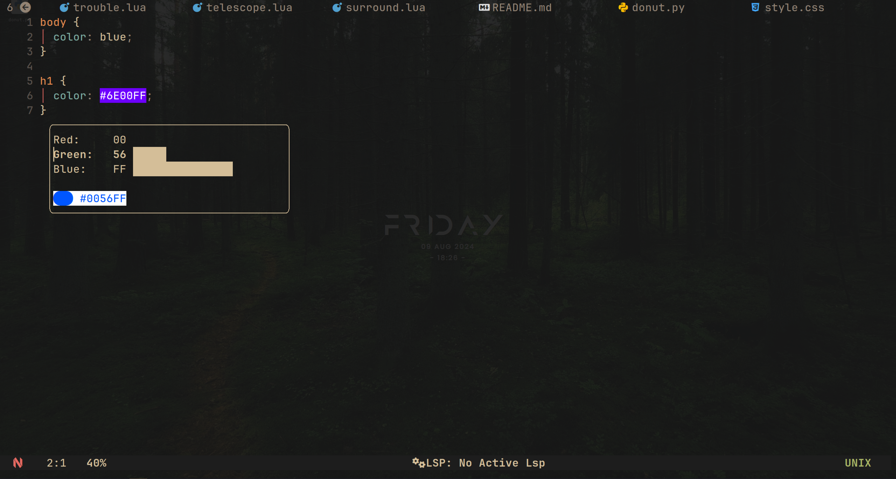

---
### 🙏 This configuration is based on two other wonderful configurations:
> ###  1. [GRIMVIM](https://github.com/bibjaw99/workstation)
> ###  2. [GenesisNvim](https://github.com/Zproger/GenesisNvim)
<br />
<details>
    <summary style="font-size: 24px;"><strong>👀 Preview config</strong></summary>
    
+   <details>
        <summary style="font-size: 1.0em; font-weight: bold;">Start page</summary>
        
    </details>

+    <details>
        <summary style="font-size: 1.0em; font-weight: bold;">Navigation</summary>
        
        
        
        
        
        
        
     </details>

+   <details>
        <summary style="font-size: 1.0em; font-weight: bold;">Language Server Protocol support</summary>
        
        
        
     </details>

+    <details>
        <summary style="font-size: 1.0em; font-weight: bold;">Debug Adapter Protocol client support</summary>
        
     </details>

+    <details>
        <summary style="font-size: 1.0em; font-weight: bold;">Preview and insert emoji/nerd font glyphs</summary>
        
        
     </details>

+    <details>
        <summary style="font-size: 1.0em; font-weight: bold;">Preview markdown file</summary>
        
     </details>

+    <details>
        <summary style="font-size: 1.0em; font-weight: bold;">Syncing with the browser</summary>
        
     </details>

+    <details>
        <summary style="font-size: 1.0em; font-weight: bold;">Tools for working with colors</summary>
        
     </details>

</details>

#### 📁 Nvim File tree

```
├── init.lua
├── lua
│   ├── ascii-art.lua
│   ├── core
│   │   ├── configs.lua
│   │   ├── lazy.lua
│   │   └── mappings.lua
│   ├── ignore_files.lua
│   └── plugins
│       ├── autosave.lua
│       ├── autotag.lua
│       ├── bufferline.lua
│       ├── cmp.lua
│       ├── colorizer.lua
│       ├── colorscheme.lua
│       ├── colortils.lua
│       ├── comment.lua
│       ├── dap.lua
│       ├── dap-python.lua
│       ├── dashboard.lua
│       ├── emoji.lua
│       ├── gitsigns.lua
│       ├── illuminate.lua
│       ├── indent.lua
│       ├── java.lua
│       ├── jdtls.lua
│       ├── lspconfig.lua
│       ├── lspsaga.lua
│       ├── lualine.lua
│       ├── mason-lspconfig.lua
│       ├── mason.lua
│       ├── mason-nvim-dap.lua
│       ├── mini.lua
│       ├── move.lua
│       ├── neotree.lua
│       ├── nerdy.lua
│       ├── noice.lua
│       ├── null-ls.lua
│       ├── nvim-notify.lua
│       ├── persistence.lua
│       ├── surround.lua
│       ├── telescope.lua
│       ├── toggleterm.lua
│       ├── treesitter.lua
│       ├── trouble.lua
│       ├── web-tools.lua
│       └── which-key.lua
```
 ---
### 📜 TODO

- [x] Preview markdown
- [x] Preview html/css (browser-sync)
- [x] Preview and insert emoji
- [x] Preview and insert nerd font glyphs
- [x] Full DAP setup
- [x] Language support: python, css, html
- [x] Description for all commands/functions
- [x] Add configuration for [vim-visual-multi](https://github.com/mg979/vim-visual-multi)
