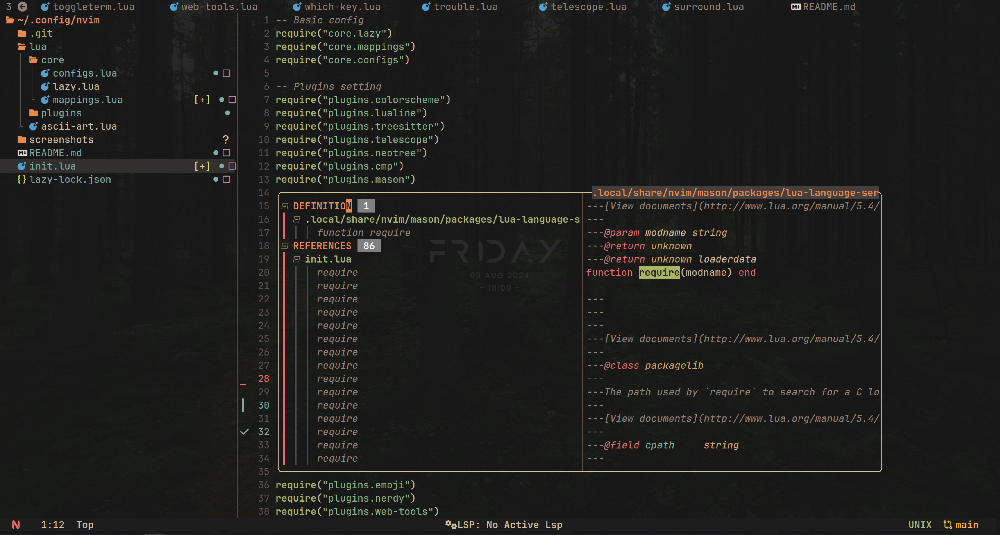
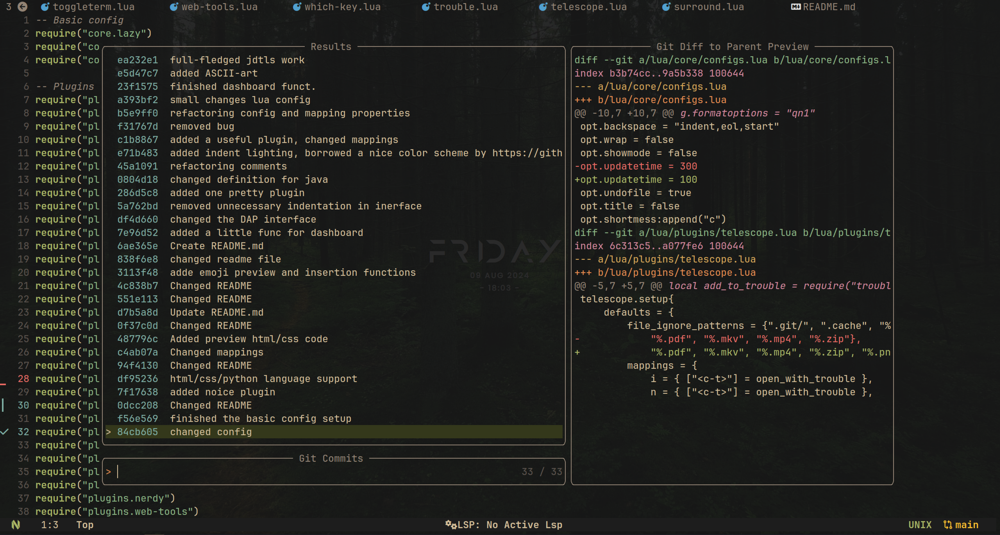

# My nvim config

- This configuration was based on the gruvbox style


<style>
    .summary-h2 {
        font-size: 1.5em;
        font-weight: bold;
    }
    .summary-h3 {
        font-size: 1.0em;
        font-weight: bold;
    },
</style>

<details>
    <summary class="summary-h2";>Preview config</summary>

+   <details>
        <summary class="summary-h3">Start page</summary>
        
    </details>

+   <details>
        <summary class="summary-h3">Main file</summary>
        
    </details>

+   <details>
        <summary class="summary-h3">Navigation</summary>
        
        
        
        
        
    </details>

+   <details>
        <summary class="summary-h3">Language Server Protocol support</summary>
        
        
        
        
    </details>

+   <details>
        <summary class="summary-h3">Debug Adapter Protocol client support</summary>
        
    </details>

+   <details>
        <summary class="summary-h3">Preview and insert emoji/nerd font glyphs</summary>
        
        
    </details>

+   <details>
        <summary class="summary-h3">Preview markdown file</summary>
        
    </details>
</details>


#### 📁 Nvim File tree

```
.
├── init.lua
└── lua
    └── core
        ├── configs.lua
        ├── lazy.lua
        └── mappings.lua
    └── plugins
        ├── autopairs.lua
        ├── bufferline.lua
        ├── cmp.lua
        ├── colorizer.lua
        ├── colorscheme.lua
        ├── comment.lua
        ├── dap-ui.lua
        ├── dap-virtual-text.lua
        ├── dap.lua
        ├── dashboard.lua
        ├── emoji.lua
        ├── gitsigns.lua
        ├── indent.lua
        ├── java.lua
        ├── jdtls.lua
        ├── lspconfig.lua
        ├── lspsaga.lua
        ├── lualine.lua
        ├── mason-lspconfig.lua
        ├── mason-nvim-dap.lua
        ├── mason.lua
        ├── mini-indentscope.lua
        ├── move.lua
        ├── neotree.lua
        ├── nerdy.lua
        ├── nvim-notify.lua
        ├── surround.lua
        ├── telescope.lua
        ├── toggleterm.lua
        ├── treesitter.lua
        ├── trouble.lua
        └── whichkey.lua
└── ascii-art.lua
```

### 📜 TODO

- [x] Preview markdown
- [x] Preview and insert emoji
- [x] Preview and insert nerd font glyphs
- [ ] Description for all command/functions
- [ ] Full DAP setup
- [ ] Support for python and C#
