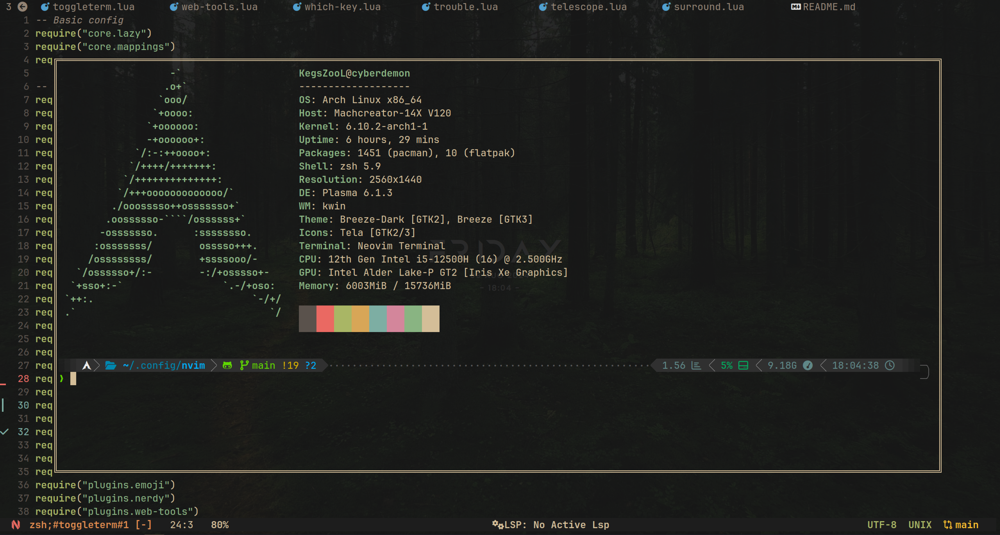

# My nvim configs

- This configuration was based on the gruvbox style

### Preview config :

##### Start page


##### Language Server Protocol support


##### Navigation




#### Debug Adapter Protocol client support


#### Main File


#### Nvim File tree

```
.
├── init.lua
└── lua
    └── core
        ├── configs.lua
        ├── lazy.lua
        └── mappings.lua
    └── plugins
        ├── autopairs.lua
        ├── bufferline.lua
        ├── cmp.lua
        ├── colorizer.lua
        ├── colorscheme.lua
        ├── comment.lua
        ├── dap-ui.lua
        ├── dap-virtual-text.lua
        ├── dap.lua
        ├── dashboard.lua
        ├── gitsigns.lua
        ├── indent.lua
        ├── java.lua
        ├── jdtls.lua
        ├── lspconfig.lua
        ├── lspsaga.lua
        ├── lualine.lua
        ├── mason-lspconfig.lua
        ├── mason-nvim-dap.lua
        ├── mason.lua
        ├── mini-indentscope.lua
        ├── move.lua
        ├── neotree.lua
        ├── nvim-notify.lua
        ├── surround.lua
        ├── telescope.lua
        ├── toggleterm.lua
        ├── treesitter.lua
        ├── trouble.lua
        └── whichkey.lua
└── ascii-art.lua
```
